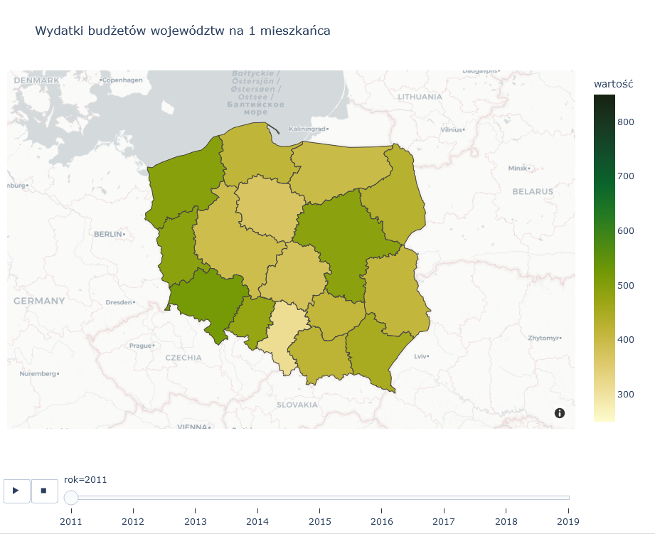

# public-data-download
downloading data from BDL API with python

This directory contains examples of downloading public data, processing and visualizing it. 

Information resources used in these examples are obtained from LOCAL DATA BANK (BDL).

The data is made available through REST API in XML and JSON format.

https://api.stat.gov.pl/Home/BdlApi

---

